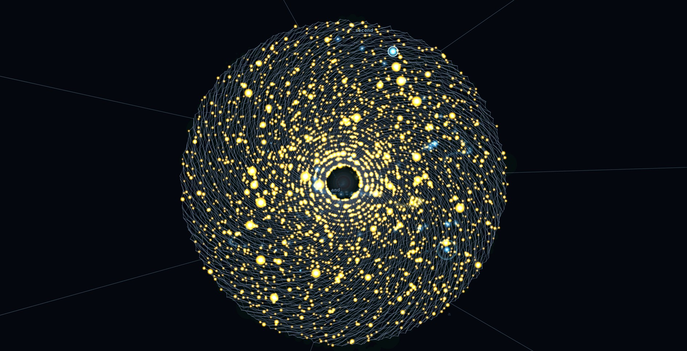
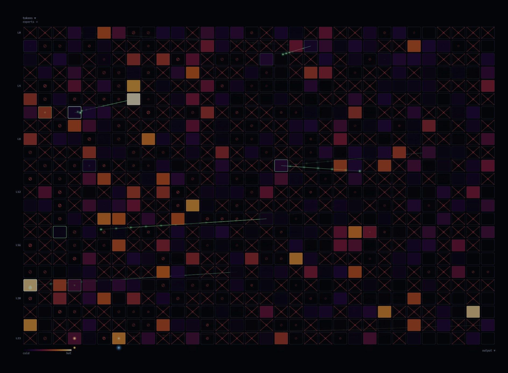
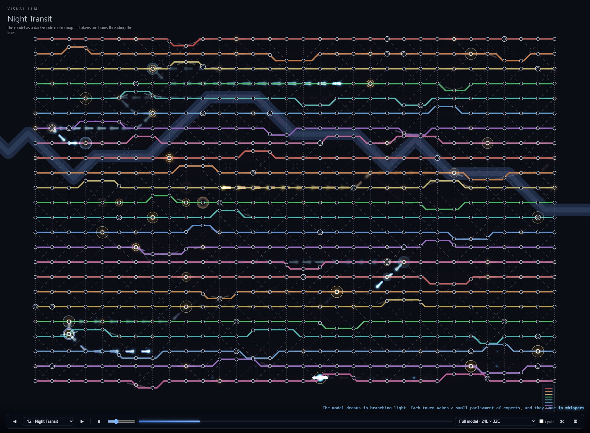
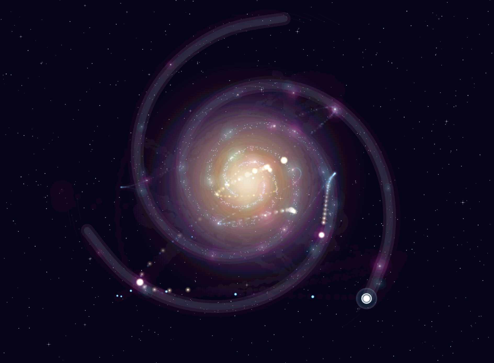
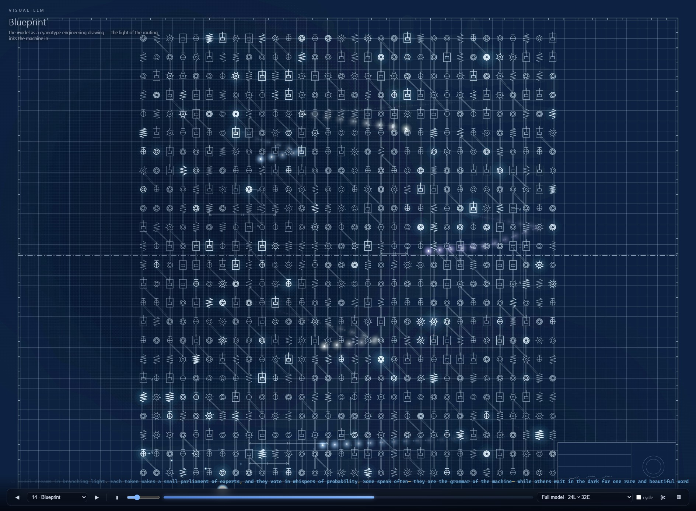
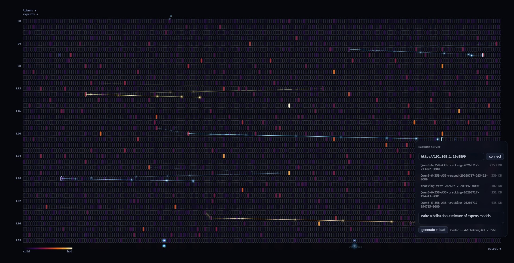

# visual-llm

**Watch a Mixture-of-Experts LLM think — as light.**

Every token an MoE model processes is routed through a handful of "experts"
per layer. visual-llm records those routing decisions from a real model
running on [llama.cpp](https://github.com/ggml-org/llama.cpp) and replays
them as light flowing through fifteen artistic visualizations — a spider web,
a brain, a galaxy, a metro map, a cathedral window… Heat accumulates where
the router lives; experts nobody visits stay dark. Those dark cells are
prunable — and this repo takes you all the way from *seeing* them to
**physically cutting them out of the GGUF**.


*Real routing from Qwen3.6-35B-A3B (40 layers × 256 experts): amber dew marks
the experts this generation actually touched.*

## Quick start — 60 seconds, zero install

```
git clone https://github.com/loktar00/visual-llm
```

Open `index.html` in a browser. That's it — no build, no server, no
dependencies. Three synthetic recordings are included (a full model, a
"reaped" variant with 38% of experts pruned, and a larger one), so everything
below works before you ever touch a GPU.

| Input | Action |
| --- | --- |
| `←` / `→`, `1`–`9` | switch visual style (15 styles, auto-cycles by default) |
| `space` / drag bar | pause / scrub the replay |
| `t` | token labels — input text at the entry, produced token at the exit |
| `u` | expert usage heatmap overlay (cold cells = reap candidates) |
| `r` | **reap lens** — dims the art and marks cold experts ⊘ and pruned experts ✕ in-place |
| `m` | **mask editor** — click experts in any style to hand-pick a reap; drag paints, alt-drag erases |
| `e` | export the mask (hand-picked if present, else the lens candidates) |
| `s` | connect to a capture server: browse recordings, prompt the model from the UI, apply your mask live |
| drag & drop | load any `.jsonl` recording |


*The Token Flow view: layers top→bottom, experts left→right, a true heatmap.
Here a reaped model wears its scars (✕) with the reap lens marking further
candidates (⊘).*

<p>


</p>
<p>


</p>

## Capture your own model

`capture/` contains **visual-llm-capture**, a small C++ tool that builds
inside a llama.cpp checkout and records the router via the supported
`cb_eval` tensor callback — no fork, no patches:

```bash
cp -r visual-llm/capture llama.cpp/examples/visual-llm-capture
echo 'add_subdirectory(visual-llm-capture)' >> llama.cpp/examples/CMakeLists.txt
cmake -B build -DGGML_CUDA=ON && cmake --build build --target visual-llm-capture -j

./build/bin/visual-llm-capture -m your-moe-model.gguf \
  -p "Once upon a time" -n 300 -ngl 99 -o run.jsonl
```

Drag `run.jsonl` onto `index.html`. Any MoE GGUF works (Qwen3 MoE family,
GPT-OSS, Mixtral, OLMoE, DeepSeek, …).

Even better: run it as an **OpenAI-compatible server** (`--server`) — every
chat request writes a recording, it slots into
[llama-swap](https://github.com/mostlygeek/llama-swap) as a "tracking" model,
and the frontend's `s` panel browses and loads recordings straight from it,
including a prompt box that generates remotely and replays the routing
seconds later. Full instructions: **[capture/README.md](capture/README.md)**.

## The reap pipeline

Cold experts carry almost none of the routed weight — so prune them. The full
loop, each step validated by the previous one:

1. **Observe** — chat through the tracking model; recordings accumulate.
2. **Determine** — `make_mask.py runs/*.jsonl -o reap-mask.txt` aggregates
   router mass across a corpus and masks each layer's coldest experts. It
   prints the % of total routed mass you'd cut — lower is safer.
3. **Rehearse** — run with `--mask reap-mask.txt` (CLI or server): masked
   experts' router logits are forced to −∞, which is *mathematically
   identical* to inference-time pruning. Same weights, live A/B against the
   full model, reversible in one restart. Or go fully interactive: press `m`,
   **click experts in the visualization** (seed from the lens's candidates,
   then refine by hand), hit *apply to server*, and your next prompt runs
   as-if-reaped — the recording comes back wearing the scars you chose.
4. **Commit** — from the UI (*reap gguf* button: balances your selection to a
   uniform per-layer count, runs the surgery on the server, streams progress)
   or by hand: `reap_gguf.py model.gguf smaller.gguf --mask …` physically
   slices the pruned experts out of the quantized GGUF (byte-exact, no
   requantization) and fixes the router + metadata. Verified on a 35B-A3B:
   **256 → 192 experts, 22.7 GB → 17.6 GB (−22%)**, with routing differences
   from the masked original *below the CPU-vs-GPU noise floor of the very
   same model*.
5. **Serve** the smaller GGUF like any normal model.

Details, guard rails, and the validation methodology:
[capture/README.md](capture/README.md).

## Repository layout

```
index.html, css/, js/     the viewer — static, no build, works over file://
js/styles/*.js            the fifteen visualizations (see STYLE_GUIDE.md)
SCHEMA.md                 the JSONL recording format
capture/                  llama.cpp capture tool (CLI + server), make_mask.py,
                          reap_gguf.py, and their documentation
```

## License

MIT
